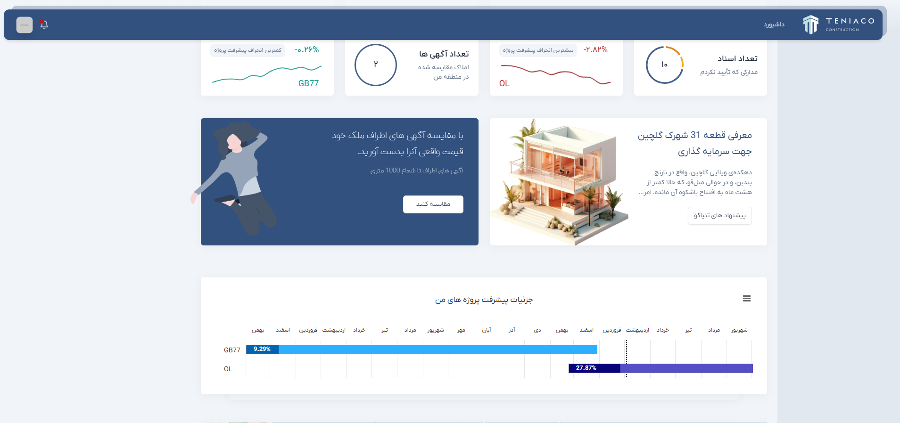
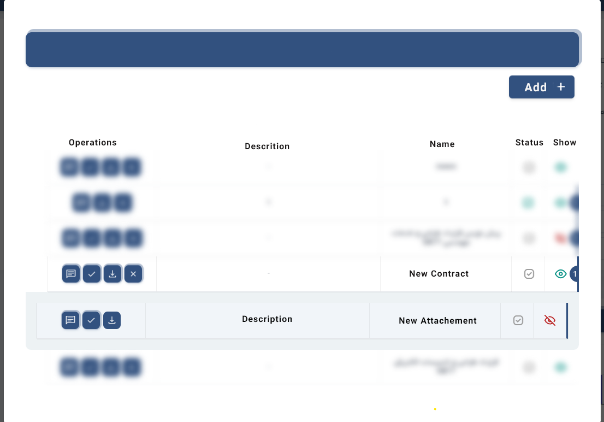
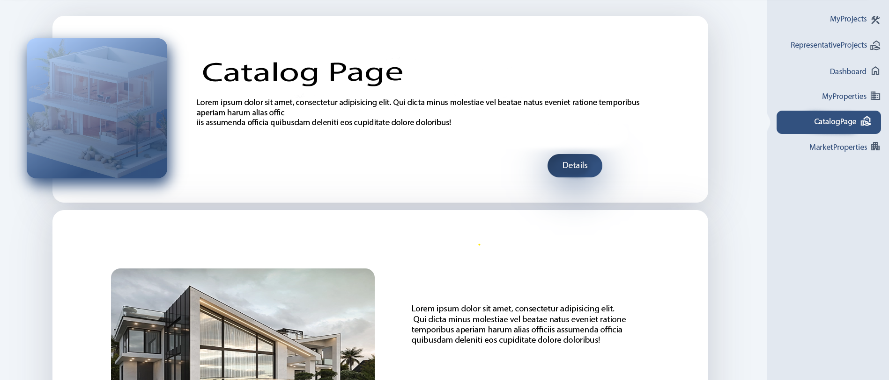
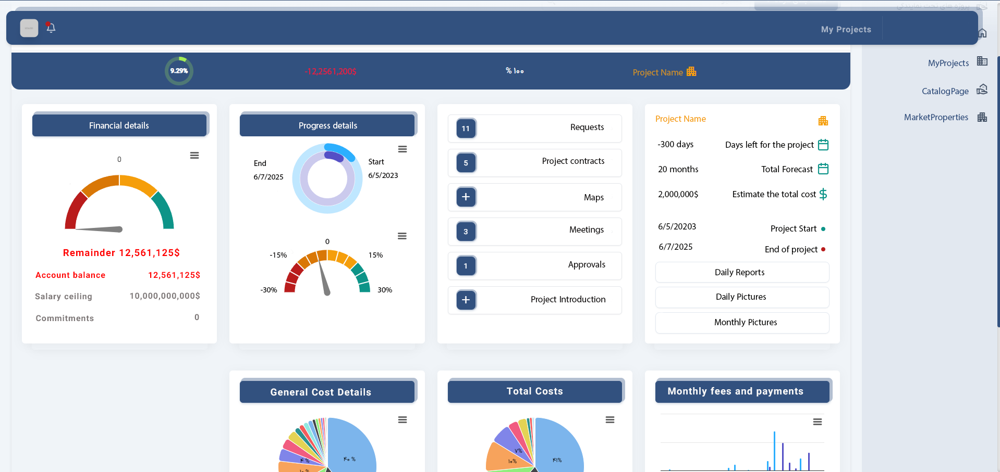

# 💼 Brikta Investor Platform

A platform where registered investors can monitor real estate projects, track their portfolio growth, and compare investments with the current market trends.

---

## 📸 Screenshots






---

## 🔍 Features

- 📈 View detailed investment portfolios
- 🏗️ Track real estate project development stages
- 📊 Compare investment performance against market benchmarks
- 🔒 Secure login system for verified investors

---

## 🧰 Tech Stack

- C# / ASP.NET MVC
- JavaScript + jQuery
- Bootstrap + TailwindCSS
- SQL Server

---

## ⚙️ Requirements

- Visual Studio 2019 or higher
- .NET Framework 4.7.2 or higher
- SQL Server running locally or remotely
- Proper connection string setup in `appsettings.json`

---

## 🚀 How to Run

```bash
# 1. Clone the repository
git clone https://github.com/codebanoo/brikta-invest.git

# 2. Open the solution (.sln) file in Visual Studio

# 3. Restore NuGet packages if needed

# 4. Update the database connection string in appsettings.json

# 5. Build and run the project (Ctrl + F5)
